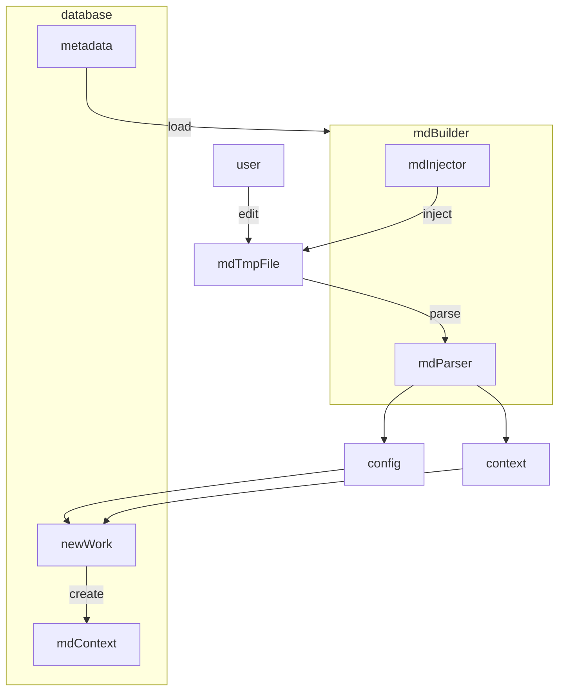
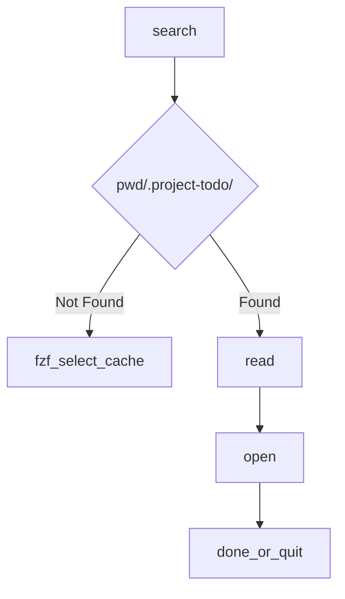
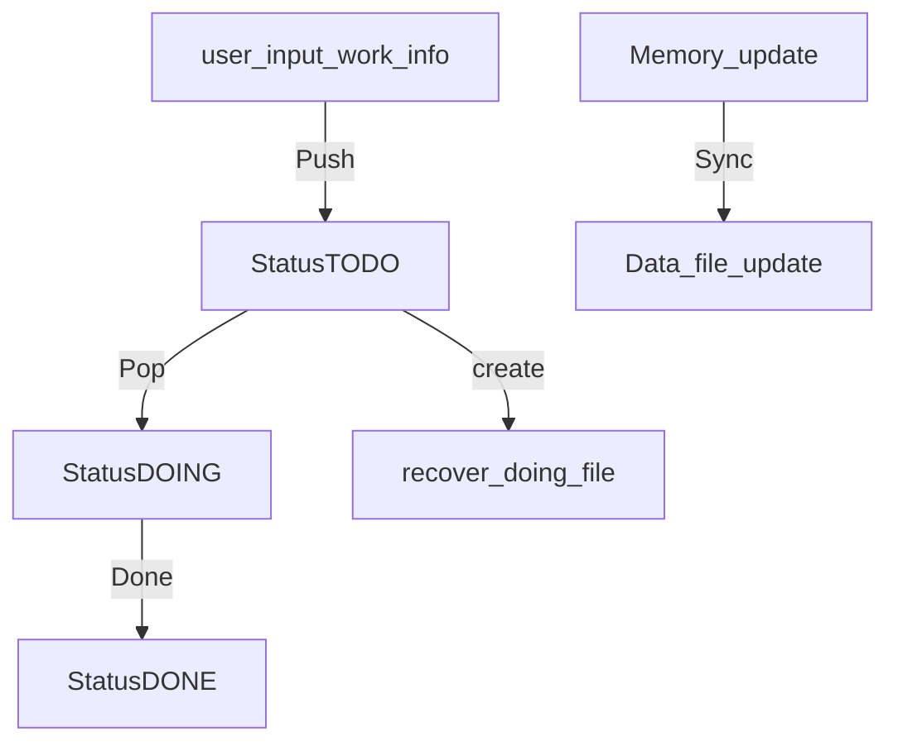

# Design of project-todo

## Analysis

Consider an `atomic task` which should not be split into several pieces or more tasks.

For example, go to F2. Go to bed. Or have a drink.

It makes no sense to split these tasks.

However, for most cases, an atomic task makes barely progress.

So we should combines several atomic task by specific sequence to make a real thing done.

We call this structure as `work`.

A work contains not just atomic tasks, it also contains `resources`, `estimated time`, `workflow` etc...

This system should not manage atomic tasks but work.

Because human will use different strategy when doing a same work.

It should flexible and readable.

---

## Core Structure

### System Domain

For this system, there is no need to use field Context and links or definition of done. It makes no sense for the system (it can't parse it). All it's function as below.

- Dependency Graph: make all work provided is really executable
- Energy Routing: Filter the work by high, medium, low energy cost for different occasions
- Life Cycle State: Update `StatusTODO`, `StatusDOING`, `StatusDONE`
- Document Pointer: Store the path to the document for specific work

### Human Domain

- Context & Links: Document reference, manual links, the golang interface just care about how the file be rendered
- Atomic Step List (Workflow): The execution sequence
- Definition of Done: The criteria for human confirm if a work is done.

## Data FlowChart

### New



### Next



- Where cache is a file store previous visit todo dir

```txt
/path/to/project1/.project-todo
/path/to/project2/.project-todo
...
```

---

## Energy Consumption Level

- High

Task required focusing. You should ensure you are clear mind and environment is quite & possible to deep work.

- Medium

Task required some energy but you can do it on a noise environment. You can do it on meet or class.

- Low

Just some click or copy-paste task which can be done almost everywhere.

---

## Task ID and Dependencies

Some task has the dependencies which means you should do the previous task so that this task is available.

This work struct use `BlockedWorksID` and `BlockedTimes` to manage their dependencies relations.

```go
type Work struct {
    // other fields...

    BlockedWorksID []string

    BlockedTimes int
}
```

- BlockedWorksID
  This field store the work id which is blocked by current work.

- BlockedTimes
  How many work block this work

**Update Process**

That's assume that Work A should be done before Work B begin

So we will get `A { BlockedWorksID = [ "B" ], BlockedTimes = 0 }` and `B { BlockedWorksID = [], BlockedTimes = 1 }`

Only work with BlockedTimes = 0 can be run now.
So we start work A then for each BlockedWorksID on A, update the work BlockedTimes with BlockedTimes -= 1

After that `B { BlockedTimes = 0 }` which means it can be started now.

This design enable quick pop and single build. Which reach the requirement of this project.

---

## DDL List

For student who develop projects and program everyday. There are some school task has the ddl. so this project will provides a ddl list to remaind user that something must be done for school. This is globally stored on \$XDG_STATE_DIR/project-todo/. And run `todo ddl` command for manage them.

> [!WARNING]
> This may not support because there is no need to manage school works on this method. And it's not the purpose of this project

---

## DataBase Interface Design



```go
// Package store define the interface [TodoDB]
// which expose the functions
// [TodoDB.Push] [TodoDB.Pop] [TodoDB.Done] [TodoDB.Sync]
// which is used for work database management
// Function details see the define of interface
package store

import (
    "time"

    "github.com/IridiumNan/project-todo/internal/filter"
    "github.com/IridiumNan/project-todo/internal/models"
    "github.com/IridiumNan/project-todo/internal/utils"
)

// generateTimestampID return a hashed string which generated from timestamp and length = 8
func generateTimestampID(inputTime time.Time) string {
    return utils.HashByTimestamp(inputTime.UnixNano(), 8)
}

type DB interface {
    // All return all works for filter return true
    // if f == nil, return all works loaded
    //
    // For [TodoDB], it just store todo works
    // For [DoneDB], it just store done works
    All(f filter.WorkFilter) ([]models.Work, error)
}

// TodoDB provide todo work with Pop function and support Push new todo work
// Use Done function to change the status on database
type TodoDB interface {
    // Push create a new work then build metadata from user input
    // It generate an ID for this work then store the context file path and it's content on the memory until [TodoDB.Sync] is called
    Push(conf *models.MDTomlConfig, contextByte []byte) (string, error)

    // Pop next Work
    // If doing data file has work which is doing, pop it first
    // else load todo data file then check if there is an available work
    //
    // this function will not manage the status of work, the status update will be handled by runner
    Pop(filter filter.WorkFilter) (*models.Work, error)

    // then write this work metadata into data file
    // data file name and path depends on the database format
    Done(work *models.Work) error

    DB

    // Sync the function makes changes on memory saved to disk
    // It contains the work metadata, context file for new work
    Sync() error
}

// DoneDB Provide read-only functions to visit works
type DoneDB interface {
    // Load all works from the data dir
    // ViewDB will search toml data file from this data dir
    // This will maintain all works has been loaded
    Load(dataDirPath string) error

    // Reload Equals to Clear then Load
    Reload(dataDirPath string) error

    // Clear remove all works on the database (memory), it will not change the database file, just remove loaded content
    Clear()

    DB
}
```
