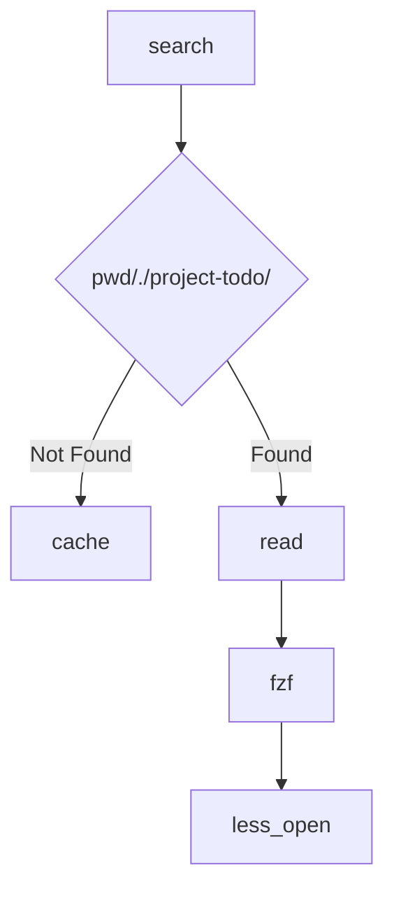

# Design of project-todo

For a Computer Science student who loves programing and go school for job. High self-teaching level. The school task is not the core target. And it makes sense for he to create a customized todo-list for different task management about project development and learning some framework. It will focus on Tasks-Dependency Tree and energy-requirement about a task, which makes clean for him to manage a lot of tasks on school (which not suitable for project development.).

## Data FlowChart



- Where cache is a file store previous visit todo dir

```txt
/path/to/project1/.project-todo
/path/to/project2/.project-todo
...
```

---

## Energy Consumption Level

- High

Task required focusing. You should ensure you are clear mind and environment is quite & possible to deep work.

- Medium

Task required some energy but you can do it on a noise environment. You can do it on meet or class.

- Low

Just some click or copy-paste task which can be done almost everywhere.

---

## Task ID and Dependencies

Some task has the dependencies which means you should do the previous task so that this task is available.

TODO: Write about its' build and management.

---

## DDL List

For student who develop projects and program everyday. There are some school task has the ddl. so this project will provides a ddl list to remaind user that something must be done for school. This is globally stored on \$XDG_STATE_DIR/project-todo/. And run `todo ddl` command for manage them.

---

## Core Structure

```go
import "time"

type Energy int

const (
 EnergyLow    Energy = iota
 EnergyMedium Energy = iota
 EnergyHigh   Energy = iota
)

type TaskStatus string

const (
 StatusDONE  TaskStatus = "DONE"
 StatusTODO  TaskStatus = "TODO"
 StatusDOING TaskStatus = "DOING"
)

type TaskDetail struct {
 // Use timestamp hash as id
 // for reference
 ID string

 // Title of this task
 // Begin with an action like write, read, recite etc..
 Title string

 EstimatedMinutes int

 // Mark the energy requirement for this task
 // Different energy requirement will be pushed into different queue
 Energy Energy

 // Context for the task, contains the link likely be used when executing this task
 Context string

 // DefinitionOfDone define the done status
 DefinitionOfDone string
}

type Task struct {
 // BlockedTasks store the ID of tasked blocked by this task
 // which means that these tasks depends on this task
 // When this task is finished, all task on this slice will updated with BlockedCount -= 1
 BlockedTasks []*Task

 // BlockedCount mark the count if it's TODO dependent task
 // if not 0, it will not be pushed into ready queue
 BlockedCount int

 // Detail of this task
 Detail *TaskDetail

 // Status
 // There are three status now
 // [StatusDONE] [StatusTODO] [StatusDOING]
 Status TaskStatus

 // CreateTime of this task for logging and record
 CreateTime time.Time

 StartTime time.Time

 EndTime time.Time
}

// ReadyQueue which store all task with BlockedCount == 0 & Status == TODO
// The key is the ID which is the hash value of create timestamp
type ReadyQueue map[string]*Task

type TaskEngine struct {
 // LowQueue store the task which contains tasks whose Energy is EnergyLow and BlockedCount == 0
 LowQueue ReadyQueue

 // MediumQueue tasks whose Energy is EnergyMedium and BlockedCount == 0
 MediumQueue ReadyQueue

 // HighQueue tasks whose Energy is EnergyHigh and BlockedCount == 0
 HighQueue ReadyQueue

 AllTasks []*Task
}
```
