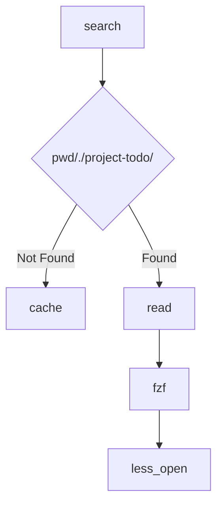

# Design of project-todo

This doc demonstrate the design of project-todo

## Data FlowChart



- Where cache is a file store previous visit todo dir

```txt
/path/to/project1/.project-todo
/path/to/project2/.project-todo
...
```

---

## Energy Consumption Level

- High

Task required focusing. You should ensure you are clear mind and environment is quite & possible to deep work.

- Medium

Task required some energy but you can do it on a noise environment. You can do it on meet or class.

- Low

Just some click or copy-paste task which can be done almost everywhere.

---

## Task ID and Dependencies

Some task has the dependencies which means you should do the previous task so that this task is available.

This work struct use `BlockedWorksID` and `BlockedTimes` to manage their dependencies relations.

```go
type Work struct {
 // other fields...

 BlockedWorksID []string

 BlockedTimes int
}
```

- BlockedWorksID
This field store the work id which is blocked by current work.

- BlockedTimes
How many work block this work

**Update Process**

That's assume that Work A should be done before Work B begin

So we will get `A { BlockedWorksID = [ "B" ], BlockedTimes = 0 }` and `B { BlockedWorksID = [], BlockedTimes = 1 }`

Only work with BlockedTimes = 0 can be run now.
So we start work A then for each BlockedWorksID on A, update the work BlockedTimes with BlockedTimes -= 1

After that `B { BlockedTimes = 0 }` which means it can be started now.

This design enable quick pop and single build. Which reach the requirement of this project.

---

## DDL List

For student who develop projects and program everyday. There are some school task has the ddl. so this project will provides a ddl list to remaind user that something must be done for school. This is globally stored on \$XDG_STATE_DIR/project-todo/. And run `todo ddl` command for manage them.

---

## Analysis

Consider an `atomic task` which should not be split into several pieces or more tasks.

For example, go to F2. Go to bed. Or have a drink.

It makes no sense to split these tasks.

However, for most cases, an atomic task makes barely progress.

So we should combines several atomic task by specific sequence to make a real thing done.

We call this structure as `work`.

A work contains not just atomic tasks, it also contains `resources`, `estimated time`, `workflow` etc...

This system should not manage atomic tasks but work.

Because human will use different strategy when doing a same work.

It should flexible and readable.

---

## Core Structure

### System Domain

For this system, there is no need to use field Context and links or definition of done. It makes no sense for the system (it can't parse it). All it's function as below.

- Dependency Graph: make all work provided is really executable
- Energy Routing: Filter the work by high, medium, low energy cost for different occasions
- Life Cycle State: Update `StatusTODO`, `StatusDOING`, `StatusDONE`
- Document Pointer: Store the path to the document for specific work

### Human Domain

- Context & Links: Document reference, manual links, the golang interface just care about how the file be rendered
- Atomic Step List (Workflow): The execution sequence
- Definition of Done: The criteria for human confirm if a work is done.

### Code

See [demo.go](./demo.go)

---

## DataBase Interface Design

```go
type TodoDB interface {
    // Push new work into database then update the counter
    Push()

    // Pop fetch a work the this work blocked process, default done and update counter
    Pop()

    // Sync the map[string]*Work into disk file
    Sync()
}
```
