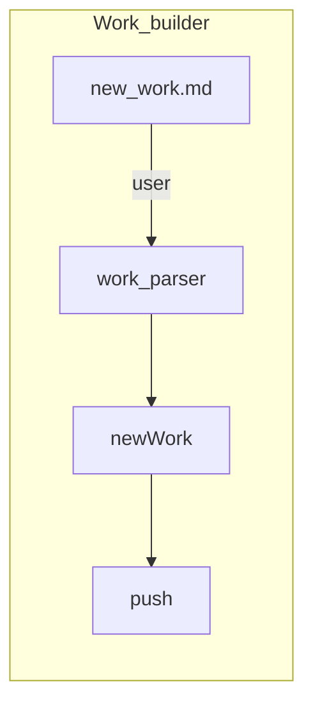

# Flow Chart for Builder



- DataDir

```tree
.project-todo
├── context
│   ├── id1-titleName
│   ├── id2-titleName
│   ├── id3-titleName
│   ├── id4-titleName
│   └── id5-titleName
├── doing-data.toml
├── done-data.toml
└── todo-data.toml
```

- `doing-data.toml` store the metadata of work whose status is DOING
- `done-data.toml` store the metadata of work whose status is DONE
- `todo-data.toml` store the metadata of work whose status is TODO

- the context dir contains all context for every work
To find the context for specific work, use metadata stored on toml file
