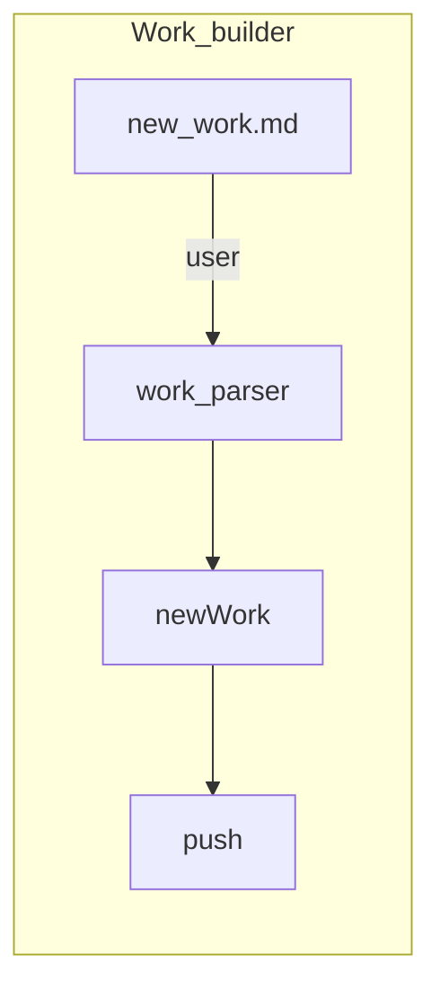

# Flow Chart for Builder



- DataDir

```tree
.project-todo
├── context
│   ├── id1-titleName
│   ├── id2-titleName
│   ├── id3-titleName
│   ├── id4-titleName
│   └── id5-titleName
└── data.toml
```

- the `data.toml` store the metadata of all works
- the context dir contains all context for every work
